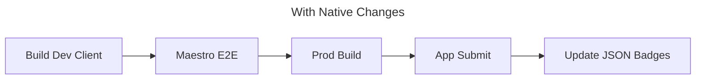
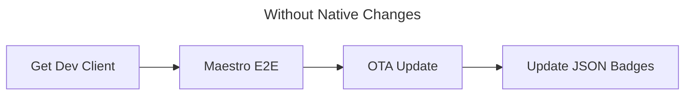

# @ng-bike/app

The expo bike sharing app (ios/android).

## Deployment status 🚦

List of the current builds, the badges are formatted like this `[Runtime Version | Release Date]`.

An OTA update is available only for the same runtime version.

| Platform | Development client                                                                                                                                                                                                                            | Production Build Submission                                                                                                  | OTA Update                                                                                                                                                               |
| -------- | --------------------------------------------------------------------------------------------------------------------------------------------------------------------------------------------------------------------------------------------- | ---------------------------------------------------------------------------------------------------------------------------- | ------------------------------------------------------------------------------------------------------------------------------------------------------------------------ |
| IOs      |  |  |  |
| Android  |  |  |  |

### Deployment journey

## Folder structure 📁

| Directory    | Description                             |
| ------------ | --------------------------------------- |
| `assets`     | The icons, images...                    |
| `components` | The react components.                   |
| `constants`  | The project constants.                  |
| `hooks`      | The project hooks.                      |
| `libs`       | The project libraries (api clients...). |
| `routes`     | The project routing.                    |
| `screens`    | The app screens.                        |

## Commands 📜

| Script      | Description                                                               |
| ----------- | ------------------------------------------------------------------------- |
| `start`     | Runs expo go                                                              |
| `android`   | Runs the app on the ios simulator.                                        |
| `ios`       | Runs the app on the android simulator.                                    |
| `test`      | Runs the test suite using Jest.                                           |
| `e2e`       | Runs the end-to-end suite using maestro.                                  |
| `typecheck` | Checks the project for type errors using the TypeScript compiler (`tsc`). |
| `lint`      | Runs ESLint.                                                              |
| `lint:fix`  | Runs ESLint and automatically fixes problems that can be fixed.           |
| `prebuild`  | Generate the graphql client and types.                                    |
